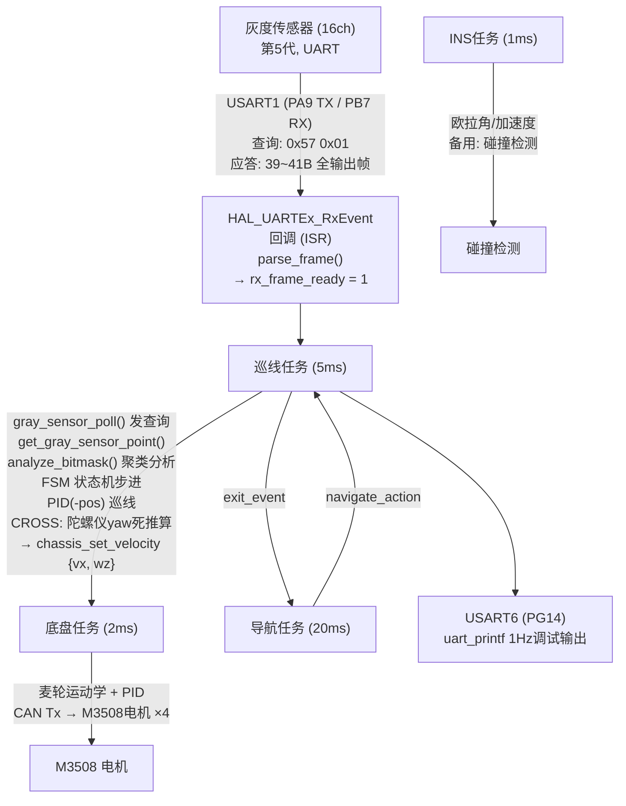
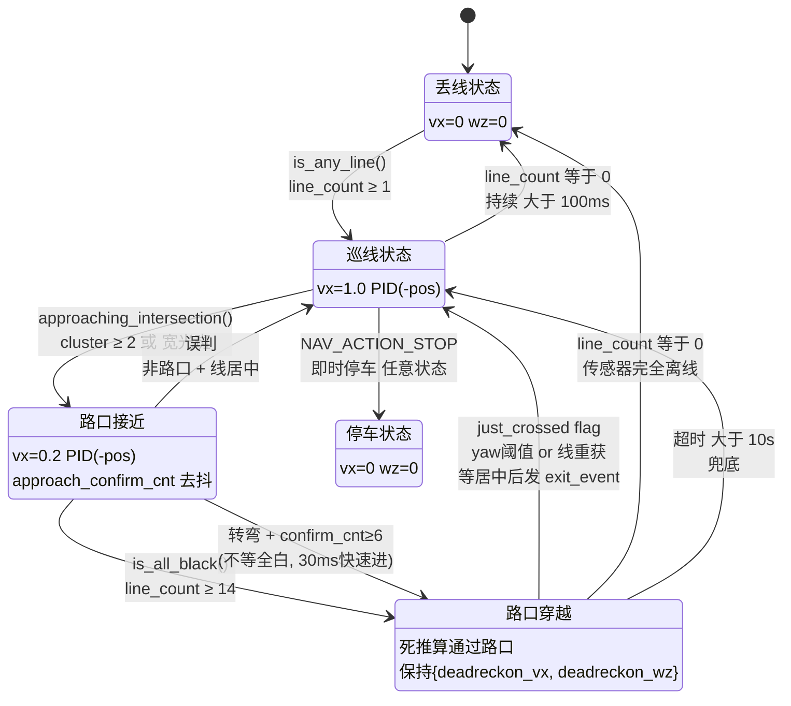
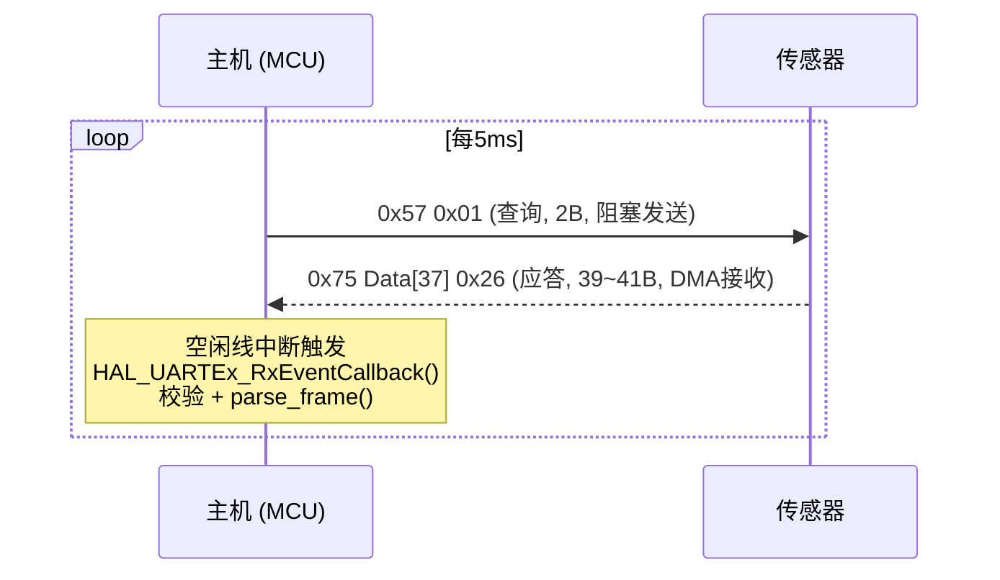
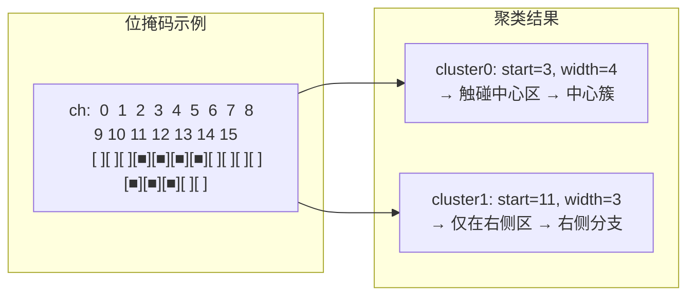
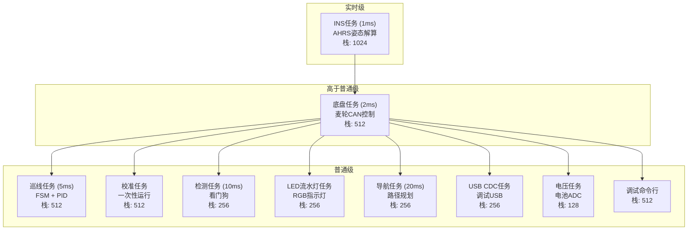

# 智能小车 — 系统架构

## 1. 系统数据流



## 2. 巡线状态机 (5 状态)



### 状态转换条件速查

| # | 源 → 目标 | 触发条件 | 耗时 |
|---|-----------|----------|------|
| 1 | LOST → TRACK | `line_count ≥ 1` | <1 tick |
| 2 | TRACK → APPROACH | `cluster ≥ 2` 或 `is_wide_blob` | 1 tick |
| 3 | TRACK → LOST | `line_count == 0` 持续 100ms | ≥20 ticks |
| 4 | APPROACH → CROSS (全白) | `line_count ≥ 14` | 立即 |
| 5 | APPROACH → CROSS (转弯) | `is_turn_action` + 连续 6 tick 路口 | 30ms |
| 6 | APPROACH → TRACK (误报) | 不再检测到路口 + 线居中 | 可变 |
| 7 | CROSS → LOST | `line_count == 0` | 立即 |
| 8 | CROSS → TRACK (陀螺仪) | `\|yaw - start\| ≥ yaw_threshold` | 按 wz 算 |
| 9 | CROSS → TRACK (传感器) | `line_reacquired` (定向判断) | 可变 |
| 10 | CROSS → TRACK (超时) | `time_in_state > 10s` | 10秒 |
| 11 | TRACK(just_crossed) → exit | 线居中或 500ms | ≤500ms |
| 12 | 任意 → STOP | `pending_action == NAV_ACTION_STOP` | 立即 |
| 13 | STOP → LOST | 新导航指令到达 | 可变 |

### 核心数据结构

```
deadreckon_vx/wz           — APPROACH预计算, CROSS消耗
deadreckon_yaw_threshold   — 转弯yaw退出阈值, >0=转弯模式, 0=直行模式
cross_yaw_start            — 进CROSS时的yaw快照
intersection_analysis      — APPROACH首次检测时快照
expected_branch            — 1=左 2=右 0=中, CROSS中定向线重获
just_crossed               — CROSS→TRACK标记, 阻塞路口检测直到居中
approach_confirm_cnt       — APPROACH连续检测计数 (去抖+转弯快速进)
```

### 死推算参数 (24种动作)

转弯动作使用陀螺仪 yaw 阈值退出 CROSS 状态（不看传感器线）。
直行动作使用传感器线重获退出。

| navigate_action | vx (m/s) | wz (rad/s) | yaw_th (度) | 说明 |
| --------------- | -------- | ---------- | ----------- | ---- |
| FORWARD         | slow     | 0.0        | 0           | 直行通过 |
| TURN_LEFT       | 0.1      | +1.0       | 80          | 直角左转 |
| TURN_RIGHT      | slow     | -1.5       | 80          | 直角右转 |
| STOP            | 0.0      | 0.0        | 0           | 停车 |
| U_TURN          | 0.15     | +3.0       | 160         | 180度掉头 |
| AROUND_LEFT     | 0.2      | +1.0       | 120         | 钝角左弧掉头 |
| AROUND_RIGHT    | 0.2      | -1.0       | 120         | 钝角右弧掉头 |
| SHARP_LEFT      | 0.15     | +2.5       | 30          | 锐角左转 (~45°) |
| SHARP_RIGHT     | 0.15     | -2.5       | 30          | 锐角右转 (~45°) |
| OBTUSE_LEFT     | 0.25     | +0.8       | 120         | 钝角左转 (~135°) |
| OBTUSE_RIGHT    | 0.25     | -0.8       | 120         | 钝角右转 (~135°) |
| FORK_LEFT       | 0.15     | +2.0       | 80          | 多岔路选最左 |
| FORK_RIGHT      | 0.15     | -2.0       | 80          | 多岔路选最右 |
| FORK_CENTER     | 0.2      | 0.0        | 0           | 多岔路选中间 |
| FORK_2ND_LEFT   | 0.18     | +1.2       | 40          | 左数第二分支 |
| FORK_2ND_RIGHT  | 0.18     | -1.2       | 40          | 右数第二分支 |
| SLOW_DOWN       | 0.1      | 0.0        | 0           | 极慢速通过 |
| SPEED_UP        | 0.8      | 0.0        | 0           | 快速通过 |
| AVOID_LEFT      | 0.2      | +1.8       | 80          | 左避障 |
| AVOID_RIGHT     | 0.2      | -1.8       | 80          | 右避障 |
| MERGE_LEFT      | 0.3      | +0.6       | 30          | 左汇入 |
| MERGE_RIGHT     | 0.3      | -0.6       | 30          | 右汇入 |
| AUTO_SELECT     | slow     | 0.0        | 0           | 自动选择方向 |

> `slow` = `LT_SLOW_SPEED` (0.2 m/s)

## 3. 灰度传感器协议 (全输出模式)



### 帧格式

```
┌──────┬────────┬────────┬────────┬───────────┬──────────┬──────┐
│ 0x75 │ Data0  │ Data1  │ Data2  │ Data3-4   │Data5-36  │0x26  │
│帧头  │数字量  │数字量  │位置信息│偏移量     │模拟量    │帧尾  │
│      │ch1-8   │ch9-16  │        │高/低      │16ch×2B   │      │
└──────┴────────┴────────┴────────┴───────────┴──────────┴──────┘
   1B      1B       1B       1B         2B         32B       1B
```

### Data2 位定义

| 位 | 含义 |
|----|------|
| bit[4:0] | line_count 压线数量 (0-16) |
| bit[5] | offset_sign 偏移符号 (1=正/右, 0=负/左) |
| bit[6] | out_line 出线方向 (1=右出, 0=左出) |
| bit[7] | 保留 |

## 4. 位掩码聚类分析



### 区域划分

```
左区 (0-4)          中区 (5-10)           右区 (11-15)
[0][1][2][3][4]     [5][6][7][8][9][10]    [11][12][13][14][15]
├─ 外围 ─┤          ├── 巡线区 ──┤          ├─ 外围 ─┤
```

### 判断逻辑

| 聚类情况 | 判断 |
|----------|------|
| 1簇, 宽度 2-4ch | 正常线段 (PID巡线) |
| 1簇, 宽度 2-4ch, 偏移 | 弯道 (PID跟踪通过) |
| 1簇, 宽度 ≥10ch | 光斑 (已进入路口内部) |
| ≥2簇 | 路口接近! |
| 中区 + 左分支 (宽度≥2) | T型路口, 左侧有出口 |
| 中区 + 右分支 (宽度≥2) | T型路口, 右侧有出口 |
| 中区 + 双分支 | 十字/多岔路口 |
| 0簇 | 丢线 |

> 分支检测要求宽度 ≥ 2 通道，过滤单通道噪声。

## 5. 导航路径 (示例)


每通过一个路口:
- `line_track_task` → `exit_event = 1`
- `navigate_task` → `g_step++` → `line_track_set_nav_action(path[g_step])`

## 6. FreeRTOS 任务布局



| 优先级         | 任务              | 周期   | 栈    | 功能                        |
| ----------- | --------------- | ---- | ---- | ------------------------- |
| Realtime    | INS_task        | 1ms  | 1024 | AHRS姿态估计 (BMI088+IST8310) |
| AboveNormal | chassis_task    | 2ms  | 512  | 麦轮底盘PID + CAN电机控制         |
| Normal      | line_track_task | 5ms  | 512  | 巡线状态机 + PID控制 (原High，降级避免饿死chassis) |
| Normal      | calibrate_task  | 一次性  | 512  | IMU传感器校准                  |
| Normal      | detect_task     | 10ms | 256  | 设备心跳/看门狗                  |
| Normal      | led_flow_task   | —    | 256  | RGB LED状态指示               |
| Normal      | navigate_task   | 20ms | 256  | 路径步进规划                    |
| Normal      | debug_console   | —    | 512  | USART6调试命令行                |
| Normal      | usb_cdc_task    | —    | 256  | USB CDC虚拟串口               |
| Normal      | voltage_task    | —    | 128  | 电池电压ADC采集                 |
