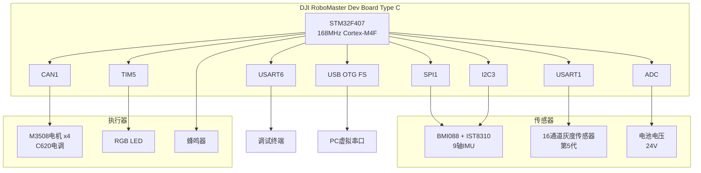
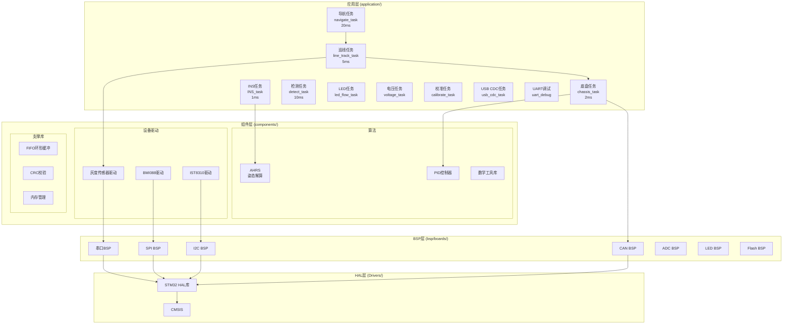
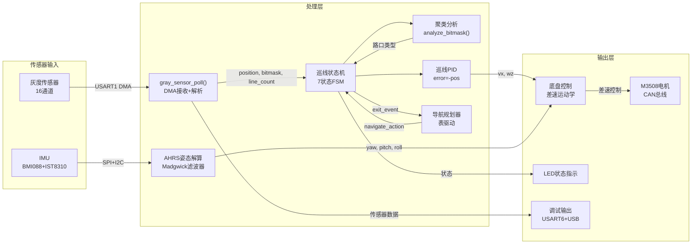
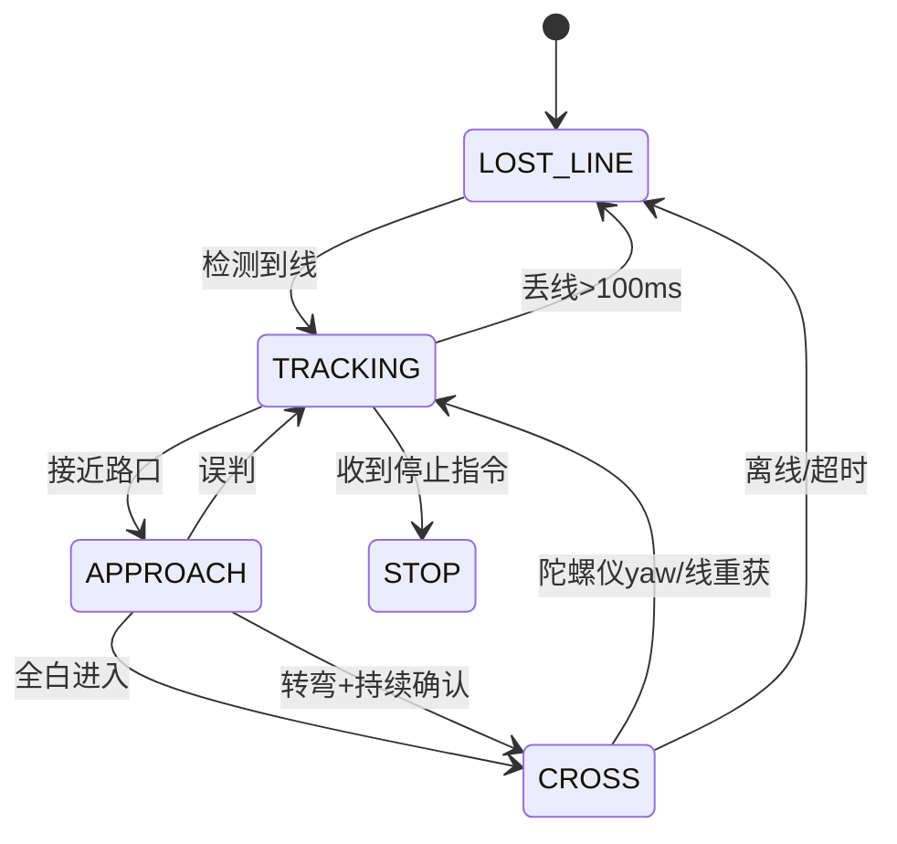

# 智能小车 — 技术路线与实现文档

## 1. 项目概述

基于 **DJI RoboMaster Dev Board Type C (STM32F407)** 的自主巡线智能小车。纯程序控制，无遥控。小车通过16通道灰度传感器巡线，通过状态机导航路口，通过数据驱动的路径规划器执行预定义路径。IMU (BMI088 + IST8310) 提供姿态估计。

### 核心特性
- 16通道灰度传感器 (第5代, UART请求-响应协议)
- 5状态巡线状态机 + 聚类分析路口检测 + 陀螺仪死推算
- 表驱动路径规划 (数据驱动，非硬编码)
- 4轮差速底盘 (M3508电机, CAN总线)
- 9轴AHRS姿态估计 (Madgwick滤波器)
- FreeRTOS实时多任务架构 (FPU上下文保存)

---

## 2. 技术栈

| 类别      | 技术                                                    |
| ------- | ----------------------------------------------------- |
| MCU     | STM32F407IGHx (Cortex-M4F, 168 MHz, HSE 12 MHz + PLL) |
| IDE/工具链 | GCC (arm-none-eabi-gcc) + Makefile, STM32CubeMX 5.2.1            |
| RTOS    | FreeRTOS 10.0.1 via CMSIS-RTOS v1.02                  |
| HAL     | STM32Cube FW_F4 V1.21.1                               |
| IMU     | BMI088 (SPI1, 6轴陀螺仪+加速度计) + IST8310 (I2C3, 3轴磁力计)     |
| 电机控制    | M3508电机 x4 via CAN1 (1 Mbps), C620电调                  |
| 传感器     | 16通道第5代灰度传感器 (USART1, UART请求-响应)                      |
| 调试输出    | USART6 TX (PG14, 115200 8N1) + USB CDC虚拟串口            |
| 数学库     | CMSIS-DSP (ARM数学库), 自定义AHRS (Madgwick滤波器)             |

---

## 3. 系统架构

### 3.1 硬件架构



### 3.2 软件分层架构



### 3.3 数据流



---

## 4. 实现方法

### 4.1 灰度传感器驱动

**协议**: 请求-响应模式
- 主机发送: `0x57 0x01` (查询命令, 2字节)
- 传感器响应: `0x75 Data[37] 0x26` (全输出帧, 39-41字节)

**数据结构**:
```c
typedef struct {
    uint16_t bitmask;      // 数字位图: bit i = 通道i+1在线上
    uint8_t  line_count;   // 压线通道数 (0-16)
    uint8_t  out_line;     // 出线方向: 0=左出, 1=右出, 2=无线
    int16_t  offset_raw;   // 原始偏移量
    fp32     position;     // 归一化位置: -1.0=左 ... 0=中 ... +1.0=右
    uint8_t  online;       // 最近一次查询成功
    uint8_t  frame_ready;  // 帧就绪标志
} gray_sensor_t;
```

**接收机制**:
- DMA循环接收 (DMA2_Stream5, Channel 4)
- 空闲线中断触发 `HAL_UARTEx_RxEventCallback()`
- `gray_sensor_poll()` 发送查询并阻塞等待响应 (最长6ms)

### 4.2 巡线状态机 (5 状态)

**状态定义**:


5 状态说明:
| 状态 | 速度策略 | 功能 |
|------|---------|------|
| LOST_LINE | vx=0, wz=0 | 停车等待线出现 |
| TRACKING | vx=1.0, PID(-pos) | 正常循线。`just_crossed` 标志处理 CROSS 退出后的居中确认 |
| APPROACH | vx=0.2, PID(-pos) | 减速接近，去抖确认路口，预计算死推算参数 |
| CROSS | vx=dr_vx, wz=dr_wz | 死推算盲过。转弯靠陀螺仪 yaw，直行靠传感器线重获 |
| STOP | vx=0, wz=0 | 停车，等待新导航指令 |

与旧版 (v2.3) 相比: 砍掉 ENTER 和 EXIT 两个过渡态。ENTER 的逻辑（等全白）已合并进 APPROACH→CROSS 的直接跳转。EXIT 的逻辑（等居中+发 exit_event）用 `just_crossed` 标志在 TRACKING 开头处理。

**死推算: 查表代替 switch**:
24 种导航动作的死推算参数 `{vx, wz, yaw_threshold}` 由 `DR_TABLE[]` 编译期查表获取，不再使用 150 行 switch-case。`VX_SLOW` 哨兵值表示"使用当前运行时的 `current_slow_speed`"。

**路口检测算法**:
- 位掩码聚类分析: 一次扫描16位掩码，找出连续黑色区域
- 区域划分: 左区(0-4), 中区(5-10), 右区(11-15)
- 分支检测: 最小宽度 ≥ 2 通道，过滤单通道噪声
- 路口去抖: `approach_confirm_cnt` 连续6 tick (30ms) 确认
- 转弯快速进入: 转弯动作 + confirm_cnt ≥ 6 → 直接进 CROSS（不等全白）
- 判断逻辑:
  - 1簇, 宽度2-4ch → 正常线段
  - 1簇, 宽度≥10ch → 光斑 (路口内部)
  - ≥2簇 → 路口接近 (T型/十字/多岔)
  - 路口分类: BLOB/CROSS/T_LEFT/T_RIGHT/MULTI/SINGLE

**CROSS 状态退出机制**:
- 转弯动作 (yaw_threshold > 0): 仅靠陀螺仪 yaw 角判断，`normalize_angle()` 处理 ±180° 边界 → TRACKING (just_crossed=1)
- 直行动作 (yaw_threshold == 0): 靠传感器线重获，考虑 expected_branch 方向 → TRACKING (just_crossed=1)
- 传感器完全离线 (line_count == 0): → LOST_LINE
- 兜底超时 (10 秒): → TRACKING

**TRACKING 中 just_crossed 处理**:
- 刚从 CROSS 退出时 `just_crossed=1`，阻塞路口检测
- 等待 `line_is_centered()` 或 500ms 超时
- 触发 `exit_event=1`，`pending_action=NONE`，`just_crossed=0`
- navigate_task 在此刻推进路径步进

### 4.3 底盘控制

**运动学模型** (差速驱动):
```
v_left  = vx - wz * WHEEL_BASE / 2
v_right = vx + wz * WHEEL_BASE / 2
```

**电机控制**:
- 每个电机独立PID控制
- CAN总线通信 (0x201-0x204)
- 速度限制: MAX_WHEEL_SPEED = 4.0 m/s

### 4.4 AHRS姿态估计

**算法**: Madgwick滤波器
- 9轴融合: 陀螺仪 + 加速度计 + 磁力计
- 解耦偏航角校正 (纯地磁Z轴旋转)
- 陀螺仪偏置估计 (ZETA=0.001)
- 参数: BETA=0.03, YAW_GAIN=0.0005

### 4.5 导航规划器

**数据驱动设计**:
```c
typedef enum {
    /* 基础动作 */
    NAV_ACTION_FORWARD    = 0,   // 直行通过路口
    NAV_ACTION_TURN_LEFT  = 1,   // 左转 (90度)
    NAV_ACTION_TURN_RIGHT = 2,   // 右转 (90度)
    NAV_ACTION_STOP       = 3,   // 停车

    /* 掉头动作 */
    NAV_ACTION_U_TURN     = 10,  // 180度掉头
    NAV_ACTION_AROUND_LEFT = 11, // 左侧大弧掉头 (钝角)
    NAV_ACTION_AROUND_RIGHT = 12, // 右侧大弧掉头 (钝角)

    /* 锐角转弯 */
    NAV_ACTION_SHARP_LEFT = 20,  // 锐角左转 (45度)
    NAV_ACTION_SHARP_RIGHT = 21, // 锐角右转 (45度)

    /* 钝角转弯 */
    NAV_ACTION_OBTUSE_LEFT = 30, // 钝角左转 (135度)
    NAV_ACTION_OBTUSE_RIGHT = 31, // 钝角右转 (135度)

    /* 多岔路口选择 */
    NAV_ACTION_FORK_LEFT = 40,   // 多岔路口选择最左分支
    NAV_ACTION_FORK_RIGHT = 41,  // 多岔路口选择最右分支
    NAV_ACTION_FORK_CENTER = 42, // 多岔路口选择中间分支
    NAV_ACTION_FORK_2ND_LEFT = 43,  // 多岔路口选择左数第二分支
    NAV_ACTION_FORK_2ND_RIGHT = 44, // 多岔路口选择右数第二分支

    /* 速度控制 */
    NAV_ACTION_SLOW_DOWN = 50,   // 减速通过
    NAV_ACTION_SPEED_UP = 51,    // 加速通过

    /* 特殊动作 */
    NAV_ACTION_AVOID_LEFT = 60,  // 左避障
    NAV_ACTION_AVOID_RIGHT = 61, // 右避障
    NAV_ACTION_MERGE_LEFT = 62,  // 左汇入
    NAV_ACTION_MERGE_RIGHT = 63, // 右汇入

    /* 状态控制 */
    NAV_ACTION_NONE       = 99,  // 无待处理动作
} navigate_action_t;
```

**动作参数映射表**:

| 动作类型 | 死推算wz (rad/s) | 死推算vx (m/s) | 说明 |
|----------|------------------|----------------|------|
| FORWARD | 0.0 | 0.2 | 直行通过 |
| TURN_LEFT | +1.5 | 0.2 | 90度左转 |
| TURN_RIGHT | -1.5 | 0.2 | 90度右转 |
| U_TURN | +3.0 | 0.15 | 180度掉头 |
| AROUND_LEFT | +1.0 | 0.2 | 钝角左转 |
| AROUND_RIGHT | -1.0 | 0.2 | 钝角右转 |
| SHARP_LEFT | +2.5 | 0.15 | 锐角左转 |
| SHARP_RIGHT | -2.5 | 0.15 | 锐角右转 |
| OBTUSE_LEFT | +0.8 | 0.25 | 钝角左转 |
| OBTUSE_RIGHT | -0.8 | 0.25 | 钝角右转 |
| FORK_LEFT | +2.0 | 0.15 | 选择最左分支 |
| FORK_RIGHT | -2.0 | 0.15 | 选择最右分支 |
| FORK_CENTER | 0.0 | 0.2 | 选择中间分支 |
| FORK_2ND_LEFT | +1.2 | 0.18 | 左数第二分支 |
| FORK_2ND_RIGHT | -1.2 | 0.18 | 右数第二分支 |
| SLOW_DOWN | 0.0 | 0.1 | 极慢速通过 |
| SPEED_UP | 0.0 | 0.8 | 快速通过 |
| AVOID_LEFT | +1.8 | 0.2 | 左避障 |
| AVOID_RIGHT | -1.8 | 0.2 | 右避障 |
| MERGE_LEFT | +0.6 | 0.3 | 左汇入 |
| MERGE_RIGHT | -0.6 | 0.3 | 右汇入 |

**路径定义示例**:
```c
// 基础路径
static const navigate_action_t demo_path[] = {
    NAV_ACTION_FORWARD,
    NAV_ACTION_TURN_LEFT,
    NAV_ACTION_FORWARD,
    NAV_ACTION_TURN_RIGHT,
    NAV_ACTION_FORWARD,
    NAV_ACTION_STOP
};

// 复杂路口路径
static const navigate_action_t complex_path[] = {
    NAV_ACTION_FORWARD,
    NAV_ACTION_SHARP_LEFT,       // 锐角左转
    NAV_ACTION_FORWARD,
    NAV_ACTION_OBTUSE_RIGHT,     // 钝角右转
    NAV_ACTION_FORWARD,
    NAV_ACTION_U_TURN,           // 180度掉头
    NAV_ACTION_FORWARD,
    NAV_ACTION_FORK_LEFT,        // 多岔路口选择最左分支
    NAV_ACTION_FORWARD,
    NAV_ACTION_STOP
};
```

**执行流程**:
1. `navigate_load_path()` 加载路径
2. `navigate_task` 轮询 `line_track_got_exit_event()`
3. 每通过一个路口，推进步骤索引
4. 调用 `line_track_set_nav_action()` 设置下一个动作
5. `line_track_task` 根据动作类型调用 `get_deadreckon_params()` 获取死推算参数
6. 路口穿越时使用死推算参数控制小车

---

## 5. 已完成功能

### 5.1 核心功能
1. ✅ **灰度传感器驱动** - 第5代传感器请求-响应协议，全输出模式，DMA接收
2. ✅ **巡线状态机** - 7状态FSM + 聚类分析路口检测
3. ✅ **位掩码聚类分析** - 支持T型、十字、Y型、锐角、钝角路口，最小宽度≥2过滤噪声
4. ✅ **表驱动导航** - 数据驱动路径规划，非硬编码
5. ✅ **差速底盘控制** - 4轮差速驱动，独立PID控制
6. ✅ **Madgwick AHRS** - 9轴姿态估计，解耦偏航角校正
7. ✅ **IMU驱动** - BMI088 + IST8310，SPI DMA，温度PID控制
8. ✅ **扩展导航动作** - 24种动作类型：基础动作、掉头、锐角/钝角转弯、多岔路口选择、速度控制、避障/汇入
9. ✅ **陀螺仪死推算** - CROSS状态转弯动作基于yaw阈值退出，不依赖传感器线重获
10. ✅ **即时停车** - NAV_ACTION_STOP从任意状态直接进入STOP
11. ✅ **FPU上下文保存** - configENABLE_FPU=1，解决Cortex-M4F浮点寄存器在上下文切换时的损坏问题
12. ✅ **优先级反转修复** - line_track_task从High降为Normal，避免饿死chassis_task (2ms周期)

### 5.2 支撑功能
9. ✅ **设备看门狗** - 离线/在线检测，优先级错误显示
10. ✅ **陀螺仪校准** - 启动自动校准，Flash持久化
11. ✅ **RGB LED状态指示** - 启动彩虹，正常呼吸，错误编码闪烁
12. ✅ **USB CDC调试** - printf/scanf over USB，环形缓冲+信号量
13. ✅ **USART6调试** - 阻塞式uart_printf
14. ✅ **电池电压监测** - ADC采集，多项式百分比曲线
15. ✅ **PID控制器库** - 位置式和增量式PID，抗积分饱和

### 5.3 开发工具
16. ✅ **Makefile构建** - GCC交叉编译，OpenOCD烧录调试
17. ✅ **架构文档** - Mermaid图表，中文标签，技术路线文档
18. ✅ **调试命令解析器** - 交互式命令界面，支持传感器输出、参数调优、路径切换

---

## 6. 计划功能 / 待完成

### 6.1 功能性工作
| 优先级 | 功能         | 描述                                    | 状态 |
| --- | ---------- | ------------------------------------- | --- |
| P0  | ~~复杂路口参数化~~    | ~~`navigate_action`枚举扩展，支持锐角、钝角、多岔路动作类型~~ | ✅ 已完成 |
| P0  | ~~调试命令解析器~~    | ~~交互式命令界面，支持传感器输出、参数调优、路径切换~~ | ✅ 已完成 |
| P0  | ~~聚类结果利用~~     | ~~`analyze_bitmask()`结果在状态机中充分利用，智能路口处理~~ | ✅ 已完成 |
| P1  | 碰撞检测       | 利用IMU加速度数据，实现障碍检测和紧急停止                | 待实现 |
| P3  | 加速度计/磁力计校准 | `calibrate_task`中未实现的校准钩子             | 待实现 |

### 6.2 测试和调试
| 优先级 | 任务      | 描述                  | 状态 |
| --- | ------- | ------------------- | --- |
| P0  | 硬件测试    | 在实际传感器上验证灰度驱动和路口检测  | 待进行 |
| P0  | ~~参数调优~~    | ~~PID参数、死推算wz值、聚类阈值等~~  | ✅ 工具已就绪 |
| P1  | 复杂路口测试  | 验证T型、十字、Y型等路口的识别和转向 | 待进行 |
| P1  | 长时间运行测试 | 稳定性、内存泄漏、任务栈溢出检测    | 待进行 |

### 6.3 代码清理
| 优先级 | 任务          | 描述                                   |
| --- | ----------- | ------------------------------------ |
| P1  | CAN2/云台代码清理 | 删除未使用的云台、触发电机代码                      |
| P2  | BSP清理       | 删除未使用的BSP模块 (laser, fric, servo, rc) |
| P2  | CubeMX配置优化  | 移除未使用的外设配置 (I2C2 OLED)               |

---

## 7. 关键配置参数

### 7.1 灰度传感器
| 参数    | 值          | 位置                                     |
| ----- | ---------- | -------------------------------------- |
| 传感器阈值 | 80 (0-255) | `gray_sensor_init(80)` in `main.c`     |
| 偏移量缩放 | 4000.0     | `GRAY_OFFSET_SCALE` in `gray_sensor.h` |
| 帧长度   | 41字节       | `GRAY_FRAME_LEN` in `gray_sensor.h`    |

### 7.2 巡线控制
| 参数 | 值 | 位置 |
|------|-----|------|
| Kp | 1.5 | `LT_KP` in `line_track_task.h` |
| Ki | 0.001 | `LT_KI` in `line_track_task.h` |
| Kd | 0.8 | `LT_KD` in `line_track_task.h` |
| 基础速度 | 1.0 m/s | `LT_BASE_SPEED` in `line_track_task.h` |
| 慢速通过 | 0.2 m/s | `LT_SLOW_SPEED` in `line_track_task.h` |
| 最大角速度 | 4.0 rad/s | `LT_MAX_WZ` in `line_track_task.h` |

### 7.3 底盘控制
| 参数       | 值       | 位置                                             |
| -------- | ------- | ---------------------------------------------- |
| 轮距       | 0.35 m  | `WHEEL_BASE` in `chassis_task.h`               |
| 电机PID Kp | 15000   | `M3505_MOTOR_SPEED_PID_KP` in `chassis_task.h` |
| 电机PID Ki | 10      | `M3505_MOTOR_SPEED_PID_KI` in `chassis_task.h` |
| 最大轮速     | 4.0 m/s | `MAX_WHEEL_SPEED` in `chassis_task.h`          |

### 7.4 AHRS姿态估计
| 参数 | 值 | 位置 |
|------|-----|------|
| Beta | 0.03 | `BETA` in `AHRS.c` |
| 偏航增益 | 0.0005 | `YAW_GAIN` in `AHRS.c` |
| 陀螺仪偏置估计 | 0.001 | `ZETA` in `AHRS.c` |

### 7.5 死推算参数

死推算通过 `get_deadreckon_params()` 从编译期 `DR_TABLE[]` 查表获取 `{vx, wz, yaw_threshold}`。
`VX_SLOW` 哨兵值 (-1.0f) 表示使用当前 `current_slow_speed` 运行时值。

**转弯动作** (yaw_threshold > 0): CROSS 状态仅靠陀螺仪 yaw 角退出。
**直行动作** (yaw_threshold == 0): CROSS 状态靠传感器线重获退出。

| 参数 | 值 | 位置 |
|------|-----|------|
| 左转wz | +1.0 rad/s | `DR_TABLE[TURN_LEFT]` |
| 右转wz | -1.5 rad/s | `DR_TABLE[TURN_RIGHT]` |
| 掉头wz | +3.0 rad/s | `DR_TABLE[U_TURN]` |
| yaw 退出阈值 | 30°-160° (24种动作) | `DR_TABLE[].yaw_th` |
| CROSS 超时 | 10000 ms | `time_in_state() > 10000` 兜底 |
| just_crossed 超时 | 500 ms | TRACKING 中 `time_in_state() > 500` |

---

## 8. 开发指南

### 8.1 添加新路径
在 `Src/main.c` 的 USER CODE PD 区域修改路径数组:
```c
// 基础路径示例
static const navigate_action_t basic_path[] = {
    NAV_ACTION_FORWARD,
    NAV_ACTION_TURN_LEFT,
    NAV_ACTION_TURN_RIGHT,
    NAV_ACTION_STOP,  // 终止符
};

// 复杂路口路径示例
static const navigate_action_t complex_path[] = {
    NAV_ACTION_FORWARD,
    NAV_ACTION_SHARP_LEFT,       // 锐角左转
    NAV_ACTION_FORWARD,
    NAV_ACTION_OBTUSE_RIGHT,     // 钝角右转
    NAV_ACTION_FORWARD,
    NAV_ACTION_U_TURN,           // 180度掉头
    NAV_ACTION_FORWARD,
    NAV_ACTION_FORK_LEFT,        // 多岔路口选择最左分支
    NAV_ACTION_FORWARD,
    NAV_ACTION_STOP
};

// 加载路径
navigate_load_path(complex_path, sizeof(complex_path) / sizeof(complex_path[0]));
```

### 8.2 调整PID参数
修改 `application/line_track_task.h` 中的宏定义:
```c
#define LT_KP   1.5f   // 比例系数
#define LT_KI   0.001f // 积分系数
#define LT_KD   0.8f   // 微分系数
```

### 8.3 调试命令解析器
通过串口（USART6, 115200 8N1）连接调试终端，输入命令进行交互式调试。

**传感器数据输出**:
```bash
gray              # 灰度传感器连续输出
grayonce          # 灰度传感器单次输出
imu               # IMU数据连续输出
imuonce           # IMU数据单次输出
motor             # 电机数据连续输出
motoronce         # 电机数据单次输出
```

**参数在线调优**:
```bash
pid 2.0 0.001 1.0 # 设置PID参数 (Kp Ki Kd)
pid               # 查看当前PID参数
speed 0.3         # 设置基础速度 (m/s)
slow 0.15         # 设置慢速通过速度 (m/s)
```

**路径控制**:
```bash
path              # 列出可用路径
path basic        # 切换到基础路径
path sharp        # 切换到锐角测试路径
path obtuse       # 切换到钝角测试路径
path uturn        # 切换到掉头测试路径
path fork         # 切换到多岔路口测试路径
path complex      # 切换到复杂路口测试路径
```

**系统控制**:
```bash
state             # 显示FSM状态、导航信息
stop              # 紧急停止
start             # 启动/恢复
reset             # 系统复位
clear             # 清屏
log on/off        # 启用/禁用日志
help              # 显示帮助
```

**测试流程示例**:
```bash
# 1. 检查传感器
grayonce
imuonce

# 2. 调整参数
pid 2.0 0 1.0
speed 0.3

# 3. 选择测试路径
path sharp

# 4. 启动测试
start

# 5. 监控状态
state

# 6. 紧急停止（如需要）
stop
```

### 8.4 添加新传感器
1. 在 `components/devices/` 创建驱动文件
2. 实现初始化、轮询、数据解析函数
3. 在 `application/` 创建FreeRTOS任务
4. 在 `Src/freertos.c` 中创建任务
5. 在 `application/detect_task.c` 中添加看门狗条目

### 8.5 调试输出
- **USART6**: 修改 `application/uart_debug.h` 中的 `DEBUG_UART`
- **USB CDC**: 使用 `usb_printf()` 函数
- **格式**: `uart_printf("GS: pos=%.2f lc=%d\r\n", position, line_count);`

---

## 9. 项目文件结构

```
smart_car/
├── application/                # FreeRTOS任务实现 (核心逻辑)
│   ├── line_track_task.c/h    # 巡线状态机
│   ├── navigate_task.c/h      # 路径规划器
│   ├── chassis_task.c/h       # 底盘控制
│   ├── chassis_behaviour.c/h  # 底盘行为模式
│   ├── INS_task.c/h           # IMU姿态估计
│   ├── detect_task.c/h        # 设备看门狗
│   ├── calibrate_task.c/h     # 传感器校准
│   ├── led_flow_task.c/h      # LED状态指示
│   ├── voltage_task.c/h       # 电池电压监测
│   ├── usb_cdc_task.c/h       # USB CDC调试
│   ├── uart_debug.c/h         # USART6调试
│   ├── debug_console.c/h      # 调试命令解析器
│   └── CAN_receive.c/h        # CAN总线通信
│
├── components/                 # 算法、控制器、设备驱动
│   ├── algorithm/
│   │   ├── AHRS.c/h           # Madgwick AHRS滤波器
│   │   ├── AHRS_middleware.c/h # AHRS中间件
│   │   ├── user_lib.c/h       # 数学工具库
│   │   └── arm_math_wrappers.c # CMSIS-DSP封装
│   ├── controller/
│   │   └── pid.c/h            # PID控制器
│   ├── devices/
│   │   ├── gray_sensor.c/h    # 灰度传感器驱动
│   │   ├── BMI088driver.c/h   # BMI088 IMU驱动
│   │   ├── BMI088Middleware.c/h
│   │   ├── BMI088reg.h
│   │   ├── ist8310driver.c/h  # IST8310磁力计驱动
│   │   └── ist8310driver_middleware.c/h
│   └── support/
│       ├── fifo.c/h           # FIFO环形缓冲
│       ├── CRC8_CRC16.c/h    # CRC校验
│       ├── mem_mang4.c        # 内存管理
│       └── linux_list.h       # 链表
│
├── bsp/boards/                 # 板级支持包 (硬件抽象)
│   ├── bsp_can.c/h            # CAN总线
│   ├── bsp_spi.c/h            # SPI
│   ├── bsp_i2c.c/h            # [已删除] I2C 残余代码
│   ├── bsp_usart.c/h          # 串口
│   ├── bsp_adc.c/h            # ADC
│   ├── bsp_led.c/h            # LED
│   ├── bsp_buzzer.c/h         # 蜂鸣器
│   ├── bsp_delay.c/h          # 延时
│   ├── bsp_imu_pwm.c/h        # IMU温度控制
│   ├── bsp_flash.c/h          # Flash存储
│   └── bsp_rng.c/h            # 随机数生成
│
├── docs/                       # 文档
│   ├── architecture.md        # 系统架构 (Mermaid图表)
│   ├── technical_roadmap.md   # 技术路线 (本文档)
│   ├── gray_sensor_manual.md  # 灰度传感器手册
│   ├── interrupt_wiring.h     # 中断接线模板
│   └── led_error_codes.md     # LED错误代码表
│
├── Drivers/                    # STM32 HAL + CMSIS (厂商提供)
├── Inc/                        # CubeMX生成的外设头文件
├── Src/                        # CubeMX生成的外设初始化 + main.c
├── Middlewares/                 # FreeRTOS + USB Device Library
├── Makefile                    # GCC交叉编译
├── smart_car.ioc               # STM32CubeMX项目文件
└── CLAUDE.md                   # 开发指南
```

---

## 10. 版本历史

### v1.0 (2026-04-27)
- 初始项目结构，基于DJI标准机器人模板
- 基础巡线功能，简单阈值判断

### v2.0 (2026-05-04)
- 灰度传感器驱动重写 (第5代协议)
- 聚类分析路口检测算法
- 调试串口迁移 (USART1→USART6)
- 删除校准模块
- 架构文档创建

### v2.1 (2026-05-07)
- 扩展导航动作类型 (21种动作)
  - 基础动作: FORWARD, TURN_LEFT, TURN_RIGHT, STOP
  - 掉头动作: U_TURN, AROUND_LEFT, AROUND_RIGHT
  - 锐角转弯: SHARP_LEFT, SHARP_RIGHT
  - 钝角转弯: OBTUSE_LEFT, OBTUSE_RIGHT
  - 多岔路口: FORK_LEFT, FORK_RIGHT, FORK_CENTER, FORK_2ND_LEFT, FORK_2ND_RIGHT
  - 速度控制: SLOW_DOWN, SPEED_UP
  - 特殊动作: AVOID_LEFT, AVOID_RIGHT, MERGE_LEFT, MERGE_RIGHT
- 死推算参数映射表
- 技术路线文档完善

### v2.2 (2026-05-07)
- 调试命令解析器
  - 传感器数据输出: gray, imu, motor (连续/单次)
  - 参数在线调优: pid, speed, slow
  - 路径切换: basic, sharp, obtuse, uturn, fork, complex
  - 系统控制: state, stop, start, reset, clear, log
  - 帮助系统: help
- line_track_task 公共API
  - line_track_get_pid/set_pid
  - line_track_get_base_speed/set_base_speed
  - line_track_get_slow_speed/set_slow_speed

### v2.3 (2026-05-07)
- 架构重构 (多Agent并行协作)
  - INS_task.c: 移除BMI088诊断代码，改用BMI088_init()驱动调用
  - 共享类型头文件: navigate_action_t 提取到 nav_types.h
  - chassis_task.h 解耦: 移除CAN_receive.h依赖，motor_measure_t内部化
  - 公共API: chassis_set_velocity/chassis_get_velocity
- 文档更新: 架构图、死推算参数表、任务列表

### v2.4 (2026-05-29)
- **FPU上下文保存修复** (P0): `configENABLE_FPU` 0→1，解决浮点寄存器在上下文切换时损坏
- **优先级反转修复** (P1): `line_track_task` osPriorityHigh→osPriorityNormal，避免饿死chassis_task
- **陀螺仪死推算**: CROSS状态转弯动作基于yaw阈值退出，不再依赖路口内不可靠的传感器线
- **位掩码噪声过滤**: 分支检测最小宽度≥2通道，消除单像素噪声导致的误触发
- **即时停车**: NAV_ACTION_STOP从任意状态直接进入STOP，不等待到达路口
- **路口去抖**: approach_confirm_cnt连续6 tick确认，转弯动作快速进入CROSS
- **代码重构**: 抽取normalize_angle()、classify_cluster()、get_action_direction()、is_turn_action()辅助函数；合并重复的状态名数组；DEG2RAD/RAD2DEG宏
- **构建系统**: 从Keil迁移至GCC + Makefile
- **调试增强**: FSM状态转换trace日志、路口分类信息输出

### v2.5 (2026-06-24)
- **状态机简化**: 7 状态 → 5 状态 (砍掉 ENTER 和 EXIT 过渡态)
  - ENTER (等全白) 合并入 APPROACH→CROSS 的直接跳转
  - EXIT (等居中+发exit_event) 用 `just_crossed` 标志在 TRACKING 开头处理
  - 状态转换路径: 11条 → 7条
- **死推算查表化**: 156行 switch-case → 29行 `DR_TABLE[]` 编译期查表
  - `VX_SLOW` 哨兵值处理"使用运行时速度"语义
- **代码精简**: line_track_task.c 758行 → 524行 (-31%)
- **CMake 构建体系**: CMakeLists.txt + gcc-arm-none-eabi 工具链文件

### v3.0 (计划中)
- 碰撞检测功能
- OLED显示
- 路径动态切换
- 聚类结果智能利用
